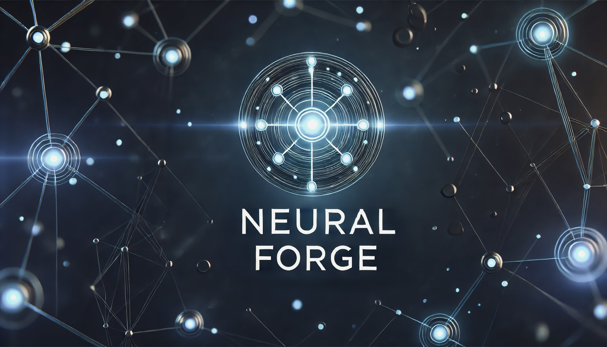

# NeuralForge

    
    
<em>A collection of AI projects and experiments</em>

## Projects

    <table>
        <thead>
            <tr>
                <th align="center">#</th>
                <th align="center">Forge</th>
                <th align="center">Description</th>
            </tr>
        </thead>
        <tbody>
            <tr>
                <td align="center">1</td>
                <td align="left"><a href="forges/001-NLP-Sexism%20Detection%20with%20LSTM%20and%20Transformer/Sexism%20Detection.ipynb">Sexism Detection with Bi-LSTM and Transformer</a></td>
                <td align="left">
                    
An implementation of sexism detection using deep learning models (Bi-LSTM and Transformer) trained on social media text data.

                </td>
            </tr>
        </tbody>
    </table>

